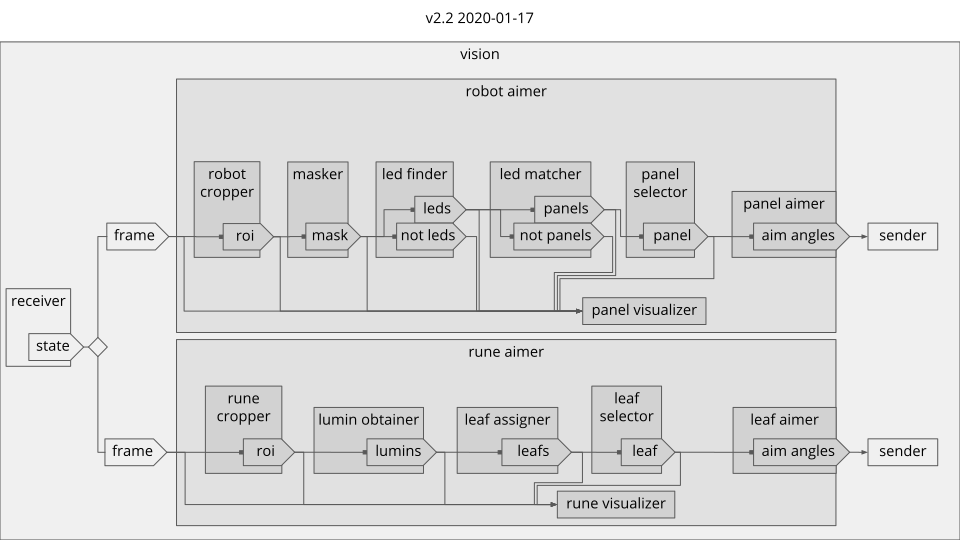

## Repo Rules
* empty `.yml` configuration fields can be assigned once during runtime and only in the module's `__init__` before all other operations
* Instances of submodules should be created in each module's `__init__`
* A module's standards should not change in effort to integrate with other modules.

## Figures
#### Code structure

#### Led object attributes

#### Confidence plot of `double_ramp` function

